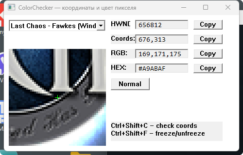

# ColorChecker — pixel coordinates and color

---

## 🇬🇧 English
**ColorChecker** is a minimalist tool for precise pixel coordinate and color detection.  
- Separate fields for HWND, Coords, RGB, HEX.  
- Copy buttons for each value.  
- Magnifier with zoom and crosshair.  
- **Freeze/unfreeze** — allows you to "freeze" moving objects and measure the exact pixel (useful for animations, videos, or dynamic content).  
- "Always on top" toggle.  
- Hotkeys: `Ctrl+Shift+C`, `Ctrl+Shift+F`.  

Build: Visual Studio, pure WinAPI, no external libraries.

---

## 🇺🇦 Ukrainian
**ColorChecker** — мінімалістична утиліта для точного визначення координат і кольору пікселя на екрані.  
- Окремі поля для HWND, Coords, RGB, HEX.  
- Кнопки Copy для кожного значення.  
- Лупа зі збільшенням та перехрестям.  
- **Freeze/unfreeze** — дозволяє «заморозити» рухомі об’єкти та точно виміряти потрібний піксель (зручно для анімацій, відео чи динамічного контенту).  
- Кнопка «Always on top».  
- Гарячі клавіші: `Ctrl+Shift+C`, `Ctrl+Shift+F`.  

Збірка: Visual Studio, чистий WinAPI, без сторонніх бібліотек.

---

## 🇷🇺 Russian
**ColorChecker** — минималистичная утилита для точного определения координат и цвета пикселя на экране.  
- Отдельные поля для HWND, Coords, RGB, HEX.  
- Кнопки Copy для каждого значения.  
- Лупа с увеличением и перекрестием.  
- **Freeze/unfreeze** — позволяет «заморозить» движущиеся объекты и точно измерить нужный пиксель (удобно для работы с анимацией, видео или динамическим контентом).  
- Кнопка «Always on top».  
- Горячие клавиши: `Ctrl+Shift+C`, `Ctrl+Shift+F`.  

Сборка: Visual Studio, чистый WinAPI, без сторонних библиотек.

---

## 🙏 Credits
Developed by **stivusus**  
Engineering support and UX guidance: **Microsoft Copilot**
